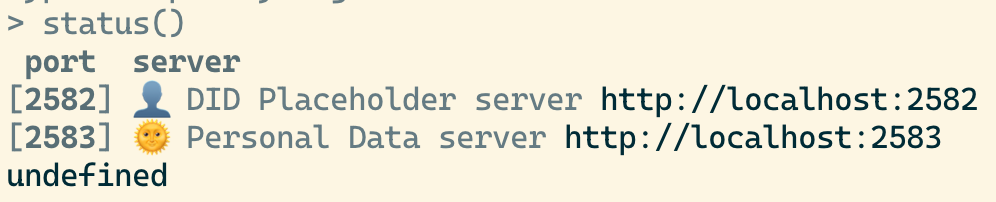

最近终于成功的玩了玩AT Protocol，接下来的内容是攻略。主要参照了 adenosine 项目中的[指南](https://gitlab.com/bnewbold/adenosine/-/blob/main/notes/atproto_quickstart.md)，感谢这个项目的作者，以及 AT Protocol Matrix 群组里人们的帮助。这个攻略主要是会用 [httppie](https://httpie.io/) 这个工具，当然你可以使用任何你熟悉顺手的 API 调试工具。

# 简介

AT Protocol的API设计很简单，所有的API都由一个[Lexion](https://atproto.com/guides/lexicon)定义，目前所有的Lexicon你可以在项目的[Lexicons文件夹](https://github.com/bluesky-social/atproto/tree/main/lexicons)下找到。具体的 Lexicon 长的像是这样：
```json
{
  "lexicon": 1,
  "id": "com.atproto.sync.getRoot",
  "defs": {
    "main": {
      "type": "query",
      "description": "Gets the current root CID of a repo.",
      "parameters": {
        "type": "params",
        "required": ["did"],
        "properties": {
          "did": {"type": "string", "description": "The DID of the repo."}
        }
      },
      "output": {
        "encoding": "application/json",
        "schema": {
          "type": "object",
          "required": ["root"],
          "properties": {
            "root": {"type": "string"}
          }
        }
      }
    }
  }
}
```

在这个 Lexicon 中，`id` 是 `com.atproto.sync.getRoot`，这个和之后的API地址有关。在`main`中，你可以看到`type`是`query`，这代表这个API用的是Get方法，在`parameters`你可以看到需要的参数和参数的类型。`output`中规定了输出结果。

具体来说，我们使用httpie调试的时会是如下命令：

```bash
http get http://localhost:2583/xrpc/com.atproto.sync.getRoot did==did:plc:yag4nqhc3ox77yj2bfjnvmaq
```

# 环境配置

首先你当然需要Clone项目[本身](https://github.com/bluesky-social/atproto)，然后需要安装Node环境，建议安装一个Node环境管理工具（比如NVM），AT Protocol 目前使用的是 Node 18 的这个 LTS 版本。

当你配置好环境当然就是

```bash
yarn install --frozen-lockfile
yarn build
```

来安装依赖。

安装完成后，进入到 `packages/dev-env` 这个子项目，输入 `yarn run start` 就可以开启测试环境了，命令输入完成后你可以通过 `status()` 来查看状态。



在默认情况下 CLI 会自动建立一个 PDS， 你可以把PDS理解成AT Protocol中的服务端，当然你也可以通过`startPds(port?: number)` 来新建更多的 PDS，具体的命令可以看[README](https://github.com/bluesky-social/atproto/tree/main/packages/dev-env)。但是请注意，不管你建立多少个 PDS，这些PDS的domain都是`test`。

# 游玩AT Protocol

当环境配置好之后，你就可以尽情的游玩 API 了。

AT Protocol API 调用很简单，API 地址为：

```
${PDSHost}/xrpc/${LexiconID}
Example:
http://localhost:2583/xrpc/com.atproto.sync.getRoot
```

大体上的流程为：`Create Account` -> `Create Session` -> `Create or Delete Record`。另外 AT Protocol 使用到 JWT ，所以在某些API上需要使用Bearer Token来验证。

和账号有关的LexiconID列表：

```
com.atproto.account.create 创建账号，请注意这里参数中的 handle 指的是username.domain，因为在测试环境domain都是test,所以handle会类似于jekyll.test.
com.atproto.session.create 登陆账号，获取Toekn
app.bsky.feed.getAuthorFeed 获取用户的Feed
app.bsky.actor.getProfile 获取用户的Profile
app.bsky.actor.updateProfile 更新用户的Profile
com.atproto.repo.createRecord 创建Record，如果你是想发送Post的话，那么Post的Collection是app.bsky.feed.post
```

这些API的用法你都可以直接看Lexicon文件中的定义，如果依旧不会使用可以直接在代码仓库中搜索这些ID，观察测试文件是怎么使用的。
