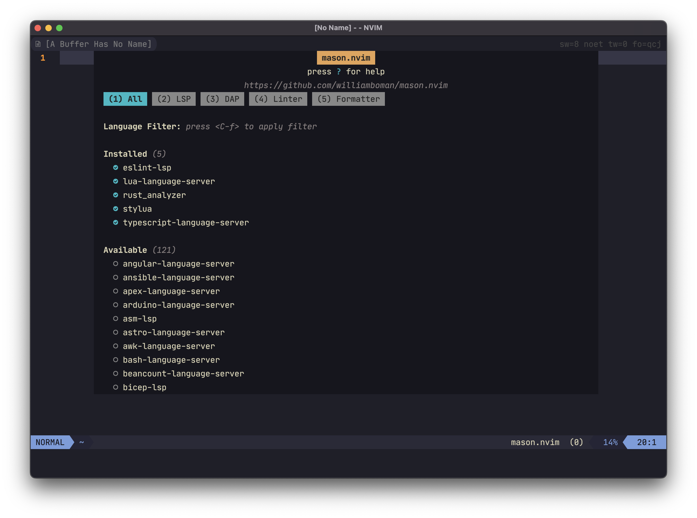

## 前言

本文将会是系列文章中的第一篇，本系列文章讲解释Neovim在配置LSP过程中涉及到的各种概念和插件，以及它们的作用。本文会解释基础的LSP配置，后续内容会解释自动补全等内容。之后可能还会有关于DAP配置的讲解。

## LSP解释

可能有的读者还不熟悉什么是LSP（Language Server Protocol），这里我希望先简单的解释一下什么是是LSP。

> The Language Server Protocol (LSP) defines the protocol used between an editor or IDE and a language server that provides language features like auto complete, go to definition, find all references etc. The goal of the Language Server Index Format (LSIF, pronounced like "else if") is to support rich code navigation in development tools or a Web UI without needing a local copy of the source code.
>
> 语言服务器协议（LSP）定义了编辑器或IDE与语言服务器之间使用的协议，该协议提供了诸如自动完成、转到定义、查找所有参考文献等语言功能。语言服务器索引格式（LSIF，发音类似于 "else if"）的目标是在开发工具或Web UI中支持丰富的代码导航，而不需要源代码的本地拷贝。

上述是微软对于LSP的官方定义。简单的来说，LSP是一个协议，Language Server可以通过这个协议给IDE或者文本编辑器（比如Neovim、VScode等），提供诸如自动补全，定义跳转等功能。总体而言，LSP定义了一个简单的服务器-客户端模型。

## 初始的配置

因为Neovim已经实现了LSP协议，所以你不需要任何插件的情况下，就可以配置使用LSP，比如下面就是一个官方的例子：

```lua
vim.lsp.start({
  name = 'my-server-name',
  cmd = {'name-of-language-server-executable'},
  root_dir = vim.fs.dirname(vim.fs.find({'setup.py', 'pyproject.toml'}, { upward = true })[1]),
})
```

可以看到，其实每个LSP配置并不复杂，你只需要让Neovim启动制定的Language Server，然后进行对于的设置就行。但是这里有两个问题：

1. 我们可能会用到很多种编程语言，要给每种编程语言都手动配置一遍，是个很繁杂的劳动。
2. 2. 对于某种语言的配置，大部分的时候大部分人的配置应该是差不多的，是可以共享的。

为了解决这两个问题，我们需要用到第一个插件：[neovim/nvim-lspconfig](https://github.com/neovim/nvim-lspconfig)。

## 默认配置

如果你注意观察 [neovim/nvim-lspconfig](https://github.com/neovim/nvim-lspconfig) 这个插件的名字的话，你会发现这个插件是个Neovim官方提供的。而这个插件的作用正是为了解决上文中提及的两个问题。它的原理很简单，就是提供了一系列默认的Language Server的默认配置，免除了用户手动配置这些Language Server的烦恼。而又因为这个插件是官方提供的，所以普通用户也可以共享同一套配置，不需要手动配置。

使用这个插件的方法也很简单，首先你需要安装这个插件，接下来你需要安装对应语言的Language Server，最后输入`require'lspconfig'.pyright.setup{}` 类似这样的配置（这里以Python的Pyright为例），就可以启用了。和之前还需要手动配置插件比起来，它已经简单了不少了，但是这里依旧还有麻烦的地方：

1. 我们还需要手动安装 Language Server
2. 手动启用对应的 Language Server 的配置。

对于程序员来说，懒惰是种美德，我们想要节省这部分的劳动，这里就带出了剩下的两个插件了。

## 自动化安装

在上文中我们提到了，虽然 [neovim/nvim-lspconfig](https://github.com/neovim/nvim-lspconfig) 让我们免除了手动配置 Language Server 之苦，但是我们依旧需要手动安装每种语言的 Language Server， 以及在安装完 Language Server 之后，启用每种语言 Language Server 的默认配置。这些行为依旧十分麻烦，所以我们就想自动化它们。为了达成这个目标，我们需要接下来两个插件：[williamboman/mason.nvim](https://github.com/williamboman/mason.nvim) 和 [williamboman/mason-lspconfig.nvim](https://github.com/williamboman/mason-lspconfig.nvim)。

我们先从 Mason 开始讲起，Mason 的作用非常简单，它提供了一个简单易懂的UI和一些方便的命令，让你可以安装包括 LSP，DAP，Linter 在内的一系列工具（我们目前只会用到 LSP 的部分，其他的东西之后会讲），当然你也可以在配置文件中预先写好你需要的工具，让它自动安装，下图是 Mason 官方的提供的一个截图，你可以很轻松的理解它的功能。



而 [williamboman/mason-lspconfig.nvim](https://github.com/williamboman/mason-lspconfig.nvim) 可能就比较抽象了，因为它没有一个UI界面提示你来做什么。但是它的作用也很好理解，它可以在你用 Mason 安装完Language Server之后，自动的启用 [neovim/nvim-lspconfig](https://github.com/neovim/nvim-lspconfig) 中对应的配置。当然魔法不会自动发生，即使你装了 [williamboman/mason-lspconfig.nvim](https://github.com/williamboman/mason-lspconfig.nvim) 这个插件，你依旧需要配置它才能实现自动化安装，因为这篇文章不会涉及到具体配置的内容，具体的配置请查阅[插件的文档](https://github.com/williamboman/mason-lspconfig.nvim/blob/main/doc/mason-lspconfig.txt)。

## 后续

当这三个插件互相配合安装完毕之后，然后你安装了一些 Language Server 和配置了快捷键之后，你的 Neovim 应该会有了一些基础 LSP 功能了，比如查看函数的定义，跳转到对应的实现或者定义部分等，但是这里还缺了一个关键的功能：自动补全。而这个功能，我们会在下一篇文章中讲解。
